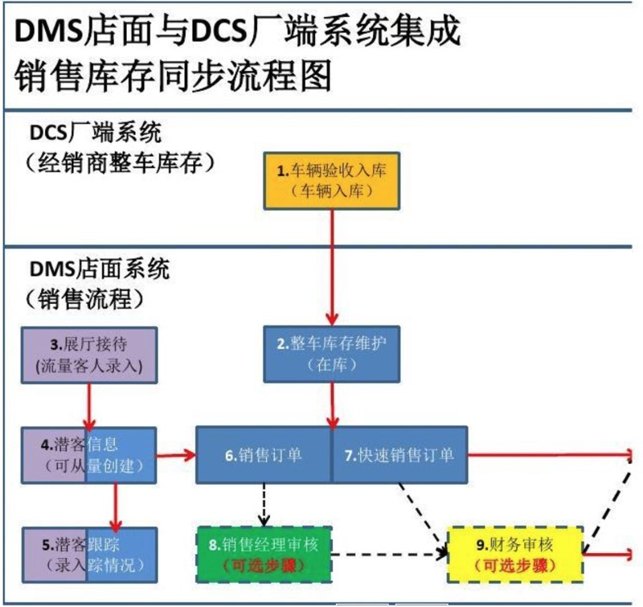

# IT厂商

此处整理一些相关的汽车领域相关的IT厂商：

首先，汽车行业内的IT主要和这些有关系：

* 汽车行业管理软件：管理汽车销售全过程
* 咨询服务业务：服务的信息化和管理咨询市场

国内一些相关厂商有：

## 英孚思为 -> 用友

之前作为国内汽车流通与零售行业软件市场的领导厂商。

* 面对整车厂：DCS（集散控制系统）系统
* 面向4S店：DMS（汽车经销商管理系统）系统

举例来说，比如在DMS店面与DCS厂端系统集成销售库存同步流程图：

而之前的客户包括18家车厂和3000多家4S经销商

2009年：

* 国内DMS软件市场占有率：28.3%
* 国内DCS软件市场占有率为：31.7%

均位居第一

英孚思为后来被用友收购。

而用友：在汽车行业的覆盖主要是车厂的后台软件（如财务软件、HR软件等）

此次收购后**用友**介入国内汽车行业前端软件（包括车载信息系统、网络通信等）

希望提供汽车行业整体解决方案：

* 整车厂前后端软件
* 整车厂DCS软件
* 经销商DMS软件