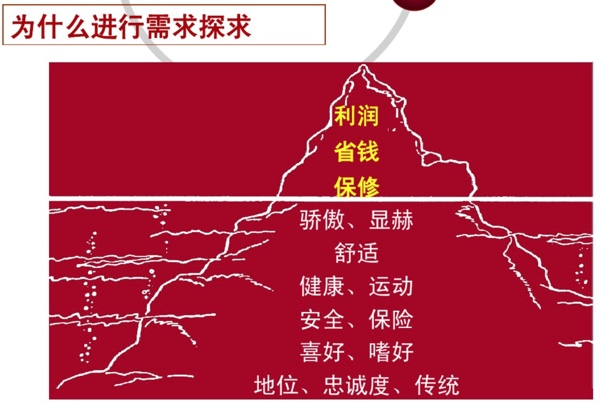

# 销售技巧

下面介绍一些汽车销售相关的技巧：

## 售前为何要探求客户需求

对于客户，其实表面上的需求和内心潜在的需求，是很复杂，往往很难直接的完全表现出来点，所以需要对应的有效的探求，才能搞清楚客户真正想要什么。

而具体如何才能问出客户真实需求，可以使用：

### 开放式询问客户

比如：

* 您为什么来我们展厅？
* 您认为在购买一台车的时候，什么对您来说最重要？
* 您现在的汽车有些什么装备？
* 您认为需要哪些配置？

### 6W1H的提问方法

而具体的询问的方法论可以总结为**6W1H**：

* `Who`**谁**：购买者、决策者、参与者、影响者等
* `When`**什么时候**：每次到店的时间（包括去竞争对手的展厅）/购买的期限
* `Where`**什么地点**：购买的地点、家庭地址、工作地点、了解信息的渠道
* `What`**什么**：意向购买的车型、关注的服务、关心的配置或功能
* `Why`**为什么**：购买的原因、用途等
* `Which`**哪种**：购买的方式
* `How much`**多少钱**：客户的预算和支付能力

### 客户行为的类型

而在销售期间，会遇到行为风格各不同的客户，所以要采取不同的策略：

* **主导型**：-> 倾听 + 立即记录
* **分析型**：-> 数据 + 专业知识
* **社交性**：-> 微笑 + 热情交谈
