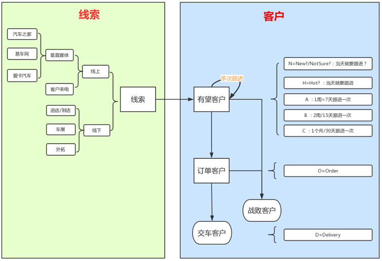

# 汽车销售全过程概览

在汽车销售领域，基本的客户状态变化可以用下图表示：

即，从线索到客户（潜客）。

## 汽车销售领域客户状态变化流程结构图

而后续整理出了更详细的流程**汽车销售领域客户状态变化流程结构图**：

> #### info::最新版本的在线分享
>
> 想要最新版本的整理，可以去在线分享的地址中查看：
>
> [汽车销售领域客户状态变化流程结构图 | ProcessOn免费在线作图,在线流程图,在线思维导图](https://www.processon.com/view/link/5a604c7ae4b0a447b9adda93)

## 汽车销售领域客户状态变化流程结构图 的解释

下面对《汽车销售领域客户状态变化流程结构图》进行一个必要的解释：

### 颜色设计：红方和蓝方

从上图的颜色构思角度来说：

* 
蓝军=我方=4S店
：4S店的所有人，算作一个总体的团队，齐心协力，共同目的目标就是：红色的目标：客户，想尽一切办法，让其尽快买车
  * 且尽量买车之后，后续订单和交车的相关的业务，都在我们4S店办理
  * 且买车的长远之后的，售后和保养，都尽量来我店处理
  * 如果可能，等二次换车，也来我店买
  * 4S店的`友军`是（背后撑腰的）车厂
    * 负责批售车辆给4S店
    * 4S店的订单和交车数据也会上报给车厂
      * 用于获得车厂店返现和补贴
* 
红军=敌人=客户
：要买车店客户
  * 被4S店`攻击`的对象
  * 但是拥有自己的自主权
  * 是否买车，取决于各种条件
    * 包括价格
    * 服务体验
    * 其他相关内容处理的是否合适

### 不同维度

#### 过程角度：售前和售后

从过程先后分：

* **售前**
* **售后**

#### 对象角度：客户和4S店

从涉及的对象分：

* （线索->）**客户**
* **4S店**（+经销商集团+车厂）

#### 不同纬度的交叉的逻辑和过程

可以看到，对于客户的，从售前的潜客和客户，到售后的基本客户，分布对应着下面的4S店的不同的人，在客户的不同阶段，处理不同的事情，以促成客户买车和相关事宜。

下面来简单解释一下，两种不同纬度上下交车的具体过程：

| 过程角度 | 对象角度 | 交叉负责的事情 |
| ------- | ------ | ----------- |
| **核心流程说明** |  |  |
| 售前 的 线索 | 4S店 的 市场部 | 市场部门会负责办理集客类的活动，收集有购车意向的客户的信息，作为**线索** |
| 售前 的 线索 | 4S店 的 邀约部 | 邀约主管会把导入的线索分配给邀约专员 邀约专员负责（通过手机号）给线索打电话 把无效的线索过滤掉，找到有效的号码 对于接了电话的有意向购车的客户，收集基本信息，建档，成为**有望客户** |
| 售前 的 未邀约到店 的 有望客户 | 4S店 的 邀约部 | 邀约专员继续对有望客户跟进，直到邀约到店：和客户谈好什么时候来4S店 |
| 售前 的 来店 的 有望客户 | 4S店 的 销售部 的 前台 | 前台对于来店的客户，会询问谁邀请过来的，然后分配给某个的销售顾问继续跟进 |
| 售前 的 已邀约已到店 的 有望客户 | 4S店 的 销售部 的 销售顾问 | 销售顾问对于有望客户进行多次跟进，正常情况下，客户的购车意向级别从最开始的N，慢慢的变成C -> B -> A -> H，然后最终下单成为**订单客户** |
| 售前 的 订单客户 | 4S店 的 销售部 的 销售顾问 | 销售顾问继续跟进，直到客户真正提车，成为 **交车客户** |
| 售后 的 基盘客户 | 4S店 的 客户关怀部 的 专员 | 专员对于已购车的**基盘客户**进行回访，且分别是间隔不同时间回访，以提高客户满意度 |
| 售后 的 基盘客户 | 4S店 的 维修部门 | 如果客户车子出问题了，过来4S店进行维护，就会涉及到维修部人员维修车辆 |
| | | |
| **其他相关说明** | | |
| 售前 的 线索 | 车厂有相关的CRM等系统，从其他渠道得到线索后 会从车厂下发线索到4S店的系统中 |  |
| 售前 的 交车客户 和 订单客户 | 4S店的 车辆管理部 负责匹配 车辆 4S店的售后相关其他部门 | 在交车和订单的过程中，都会涉及到： 库存 各种**边际**，比如上牌、保险等等事宜  | |
| 售前的 客户 的 交车 和 订单 | 4S店的系统中会有订单和交车单 | 对应着4S店系统会上报到车厂的 交车 和订单的系统中 |
|  | 4S店的年度有个批售的资金计划 | 对应着车厂会**批售**车辆给经销商，从总部库存运输到经销商4S店的库存 |

## 汽车销售领域流程总结

整个汽车销售的过程，可以用一句话概括：
**（4S店的各个部门的）一堆人努力促成（作为一个）客户（的你）尽快买车**
