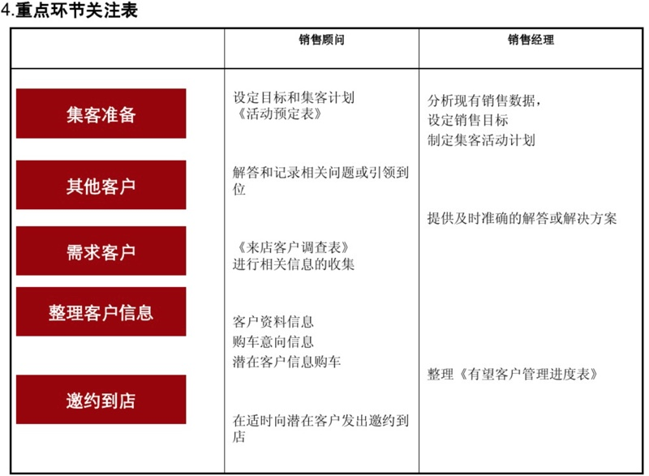
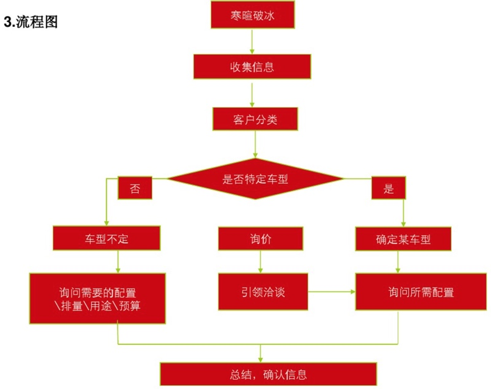

# 线索和潜客

对于从无到有的角度来说，先是有线索，然后才有客户

对应的典型流程是：

* 从各种渠道获得了线索
  * 比如在线的汽车之家，线下的车展，直接进4S店
* 然后对应的负责处理线索的邀约专员/DCC专员去打电话
  * 筛选过滤得到有效的有意向的购车的客户
  * 询问到客户的更加详细的信息
  * 然后去建卡，形成潜客
* 潜客在最开始是N级，表示不确定的购车意向，
  * 阶段是：有望客户
  * 通过及时跟进，知道客户的大致购车意向如何，想要买什么样的车，大概的预算如何等等
  * 然后继续多次跟进，最终从有望客户变成订单客户
    * 交了定金，签了单
  * 继续跟进，直到交车
    * 付余款，提车
* 之后作为已购车的用户，叫做：基盘客户
  * 作为客户关怀部，会有专员对于你进行不定期（3天/7天/1个月等）去回访
    * 以提高客户满意度
      * 当然是为了：希望你以后可以抽空过我店进行车的保养/维修 + 甚至以后继续能来第二次买车

## 线索和潜客的基本流程和关注点

典型场景中，先要去收集客户，此时就要去进行一些外部拓展点活动去收集潜在购车意向的客户，对应流程是：

然后客户进店，前台的接待客户的流程是：

在此期间，销售顾问和销售经理需要关心的事情有哪些：

接着再说，在客户进店后的接待流程是：

对应的需要关注的点：

